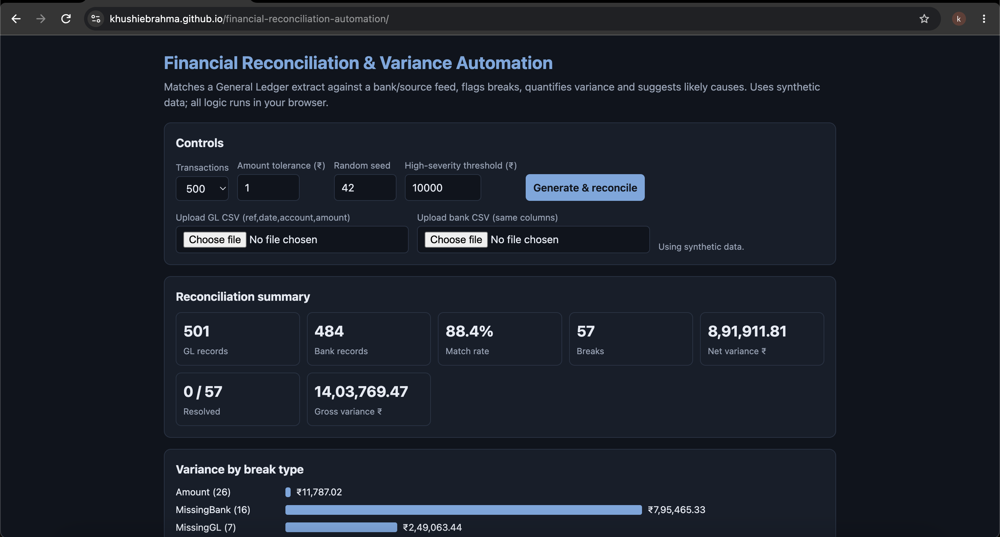

# Financial Reconciliation & Variance Automation

Automates ledger-to-bank reconciliation: matches records, flags breaks, quantifies variance, rates severity and suggests likely causes so a reviewer can triage exceptions quickly.

**[Live demo](https://claude.ai/artifact/JmsN1UCbxGd6LFVQh1cN1U)** · Built by [Khushie Brahma](https://github.com/YOUR-USERNAME)

> Uses synthetic data only. Every flagged exception needs human review.



## Why this exists
Finance and control teams reconcile large volumes of records every day, and most of the time goes to finding the few items that don't match. This project automates the matching and ranks the exceptions by size so effort goes where the risk is.

## Features
- **Matching engine:** matches GL and bank records on reference ID, with a configurable amount tolerance.
- **Four break types:** amount mismatch, missing in bank, missing in GL, duplicate GL posting.
- **Variance analysis:** match rate, net and gross variance, variance by break type and by account.
- **Severity rating:** High / Medium / Low against a configurable threshold.
- **Review workflow:** status per exception (Open, Under review, Resolved, Write-off), saved in the browser.
- **Bring your own data:** upload GL and bank CSVs in the web app (`ref,date,account,amount`).
- **Rule-based likely causes:** for example timing/cut-off, unposted receipt, duplicate batch upload.
- **Export:** copy the filtered exception report as CSV.

## Project structure
```
├── index.html            # Web app (single file, no dependencies)
├── python/
│   ├── generate_data.py  # Creates synthetic GL and bank CSVs
│   └── reconcile.py      # Same matching logic as a command-line tool
├── sample_data/          # Example inputs and an example exception report
├── docs/                 # Screenshot(s)
└── README.md
```

## How it works
1. Index GL and bank records by reference ID.
2. GL record with no bank match → **MissingBank**. Bank record with no GL match → **MissingGL**.
3. Reference seen twice in the GL → **Duplicate**.
4. Matched records whose amounts differ by more than the tolerance → **Amount**.
5. Rank breaks by absolute variance, assign severity, attach a rule-based likely cause.

## Run it
**Web app:** open `index.html` in a browser, or use the live demo above.

**Python (3.8+, standard library only):**
```bash
python python/generate_data.py 500 42        # optional: regenerate sample data
python python/reconcile.py sample_data/gl.csv sample_data/bank.csv 1 10000
# args: GL file, bank file, tolerance (default 1), high-severity threshold (default 10000)
```
Sample output on the included data:
```
GL rows: 499 | Bank rows: 485 | Match rate: 88.5%
Breaks: 56 | Net variance: 714,312.83 | Gross variance: 1,971,715.99
By type: {'Duplicate': 12, 'MissingGL': 13, 'MissingBank': 15, 'Amount': 16}
```
Writes `exception_report.csv` with variance, break type, severity, likely cause and status.

## Tech
JavaScript (web app), Python (CLI). The same logic maps to SQL (`FULL OUTER JOIN` on reference ID with an amount-difference filter).

## Possible next steps
- SQL version of the matching logic
- Fuzzy matching when reference IDs are missing or inconsistent
- LLM-generated exception summaries with human sign-off
- Many-to-one and partial-settlement matching

## License
MIT
